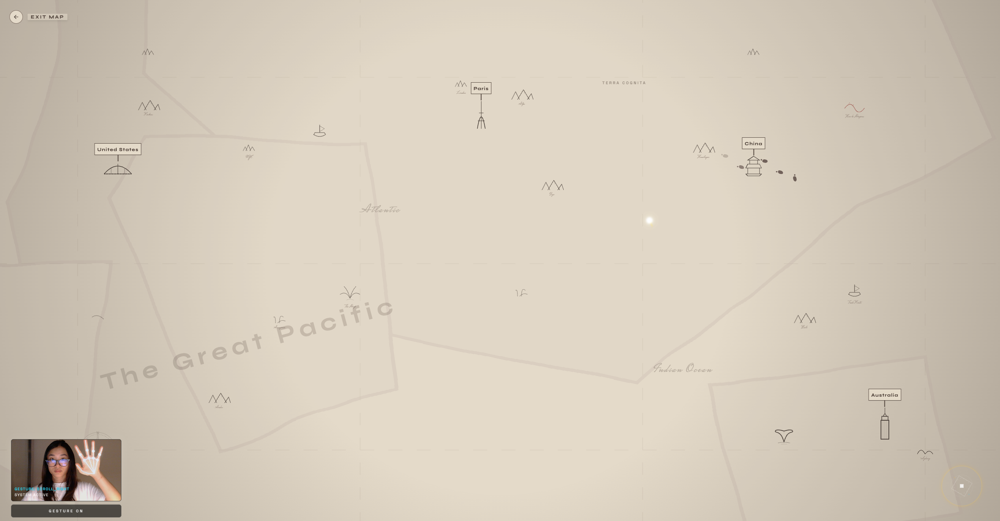
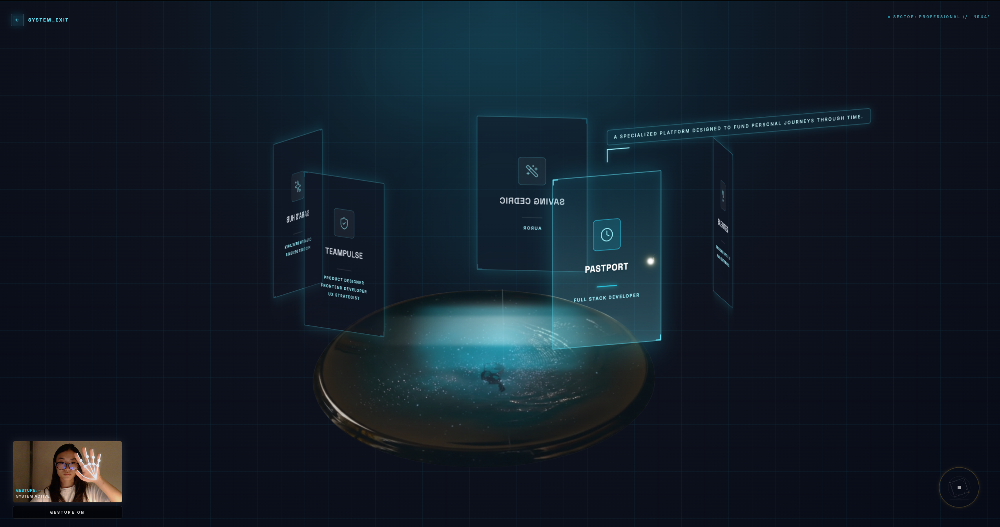

# Sara Portfolio Hub

A gesture-enabled, cinematic interactive portfolio experience blending personal journey and creative projects through immersive UI layers.

👉 **Live Demo:** https://saralianghub.netlify.app/

👉 **Demo Video:** <gif>

<div align="center">
  <video src="https://github.com/user-attachments/assets/f9f1a24c-29d1-41ed-8141-5630f9a1819d" controls="controls" style="max-width: 100%;">
  </video>
</div>

## Table of Contents
- [Design & Architecture](#-design--architecture)
- [ Technical Highlights](#technical-highlights)
- [ The Gesture Guild (Interaction Guide)](#gesture-guild)
- [ Technical Requirement](#technical-requirements)
- [File Struture](#file-structure)
- [Getting Started](#getting-started)
- [Future Roadmap](#-future-roadmap)
- [Author](#author)


## 🎨 Design & Architecture

The concept of **Sara’s Hub** is built on a "Dual-World" narrative, transforming the standard portfolio sections into two distinct immersive realms. This spatial separation helps users switch mental models between exploring my personal journey and evaluating my technical craft.

### The Concept: Two Realms
**🪐 Voyager (Personal Journey):** A narrative-driven world inspired by the *Marauder’s Map*. The UI uses warm, parchment-like tones. It visualizes my history—from moving countries to studying psychology—as a spatial map. Users "travel" through my past rather than reading a timeline, and uncover content with "ink spill" animations.



**⚗️ Alchemist (Professional Work):** A workspace-inspired realm where code is the ingredient. The aesthetic shifts to cool, deep blues and glassmorphism. This section uses a *Pensieve* aesthetic to treat projects as "memories" or "concoctions" that can be summoned and inspected.




### Interactive Elements
* **Code as Magic:** The UI operates on the metaphor that Development = Magic. Instead of standard clicks, users perform "spells" (gestures) to interact.
* **Wand Cursor:** A custom cursor with a magical trail provides immediate visual feedback to guide hand position.
* **Living Worlds:** 
  * **Voyager:** Features whisper-like text animations, ink spills on selection, and wandering footprints to simulate magical motion.
  * **Alchemist:** Uses floating project cards and a fluid background to create a sense of weightless discovery.
* **Gesture UX:** The camera view includes a physical toggle for control, and the "Gesture Guild" is always accessible as a rules reminder.


## <a id="gesture-guild"></a>🖐️ The Gesture Guild (Interaction Guide)

Since this interface relies on non-traditional inputs, I built the **Gesture Guild**—an always-accessible help system that teaches users the "spellcasting" language.

The system uses **MediaPipe** to track 21 hand landmarks in real-time, mapping specific hand shapes to UI events.

| Gesture | Action | "Spell" Equivalent |
| :--- | :--- | :--- |
| **Open Palm** ✋ | **Hover / Move** | *Lumos* (Guides the cursor) |
| **Summon** ✊ | **Grab / Drag** | *Accio* (Active interaction) |
| **Dismiss** ✋ | **Throw sway** | *Finite* (Dismiss selection) |

> **UX Note:** To prevent "gorilla arm" (fatigue), I implemented a **physical toggle** in the camera UI. Users can switch between Mouse and Gesture control at any time, prioritizing accessibility.


## <a id="technical-highlights"></a>⚙️ Technical Highlights
Gesture Smoothing Engine: Raw MediaPipe data is noisy. I implemented a custom Exponential Moving Average (EMA) smoothing algorithm (smoothing.ts) to ensure the "wand" cursor feels weighted and fluid, eliminating jitter.

React + MediaPipe Integration: Built a custom hook to bridge the imperative MediaPipe event loop with React's declarative state model, ensuring high-performance updates without unnecessary re-renders.

Dual-Input System: The interface seamlessly switches between Mouse and Hand inputs based on distinct velocity thresholds, prioritizing user intent.

### Key Systems
- **Gesture Engine**: Hand tracking + gesture classification, mapped to confirm/dismiss/scroll/summon actions.
- **Action Layer**: Central action API for focus, confirm, dismiss, scroll.
- **Custom Cursor**: Single cursor driven by mouse or gesture input, with gesture priority when enabled.
- **Gesture Guild**: Overlay help UI with animated iconography and descriptions.
- **Universe/World Routing**: Animations between views, hover focus boundaries, and selection via confirm.


## Technical Requirements

### Runtime
- Node.js (LTS recommended)
- npm or pnpm

### Core Dependencies
<div align="center">

  
  
  
  
  

</div>


## File Structure
```
sara-porfolio-hub-/
├─ components/
│  ├─ GestureController.tsx
│  ├─ UniverseView.tsx
│  ├─ PersonalGalaxy.tsx
│  └─ ProfessionalGalaxy.tsx
├─ gesture/
│  ├─ gesture-logic.ts
│  └─ smoothing.ts
├─ assets/
│  └─ media/
├─ actions.ts
├─ constants.ts
├─ types.ts
├─ App.tsx
└─ README.md
```

### Files of Interest
- `App.tsx`: App shell, view routing, gesture controller mount, guide trigger.
- `components/GestureController.tsx`: Camera UI, gesture handling, cursor mapping.
- `gesture/gesture-logic.ts`: Gesture detection and thresholds.
- `components/UniverseView.tsx`: Landing interactions and hover focus.


## Getting Started

### Clone
- npm install
- npm run dev

### Build

- npm run build

## 🔮 Future Roadmap
- Mobile Optimization: Currently desktop-first. Plan to implement a touch-based fallback for the "spells" on mobile devices.

- Accessibility (a11y): Adding keyboard navigation support to ensure the "Voyager" map is traversable without a mouse or camera.

- Performance: exploring WebWorkers to offload the MediaPipe processing from the main thread.


## Author
Sara Liang — leungyunyee@gmail.com — https://au.linkedin.com/in/sara-liang-au
